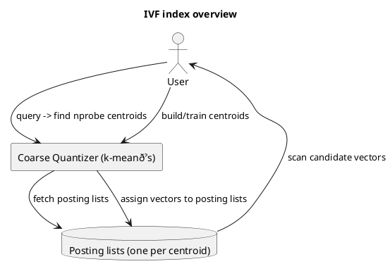
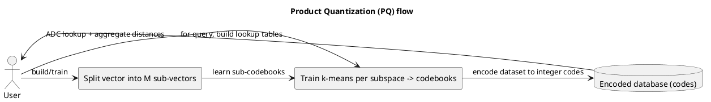
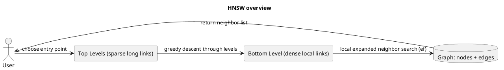

## Indexes deep-dive: IVF, HNSW, and PQ

This document explains three widely-used indexing and compression building blocks for vector search: Inverted File (IVF), Hierarchical Navigable Small World (HNSW), and Product Quantization (PQ). Each section provides an intuition, how it works, complexity trade-offs, a PlantUML diagram to illustrate the components, simple code examples, and which vector databases commonly use the technique.

---

## Inverted File Index (IVF)

High-level idea
- Partition the vector space into multiple coarse clusters (called Voronoi cells). At query time, only search inside a small number of the closest clusters instead of scanning the whole dataset.

When to use
- Large datasets where exact nearest neighbor search is too costly.
- Works well when a coarse quantizer (k-means) can partition the data meaningfully.

Key operations and complexity
- Build: cluster dataset into `nlist` coarse centroids (k-means) — O(n * k * iters) roughly.
- Add: assign each vector to its closest centroid (append to that posting list) — O(d * nlist) if naive.
- Query: find `nprobe` nearest centroids to the query, then search vectors in those posting lists (can be linear scan, or combined with PQ/HNSW inside lists).

Trade-offs
- Smaller `nprobe` -> faster, may miss true neighbors.
- Larger `nlist` -> smaller posting lists, less per-list scan work, but higher memory for centroids and more expensive training.

PlantUML diagram



Example (FAISS-like, conceptual)

Python pseudocode (conceptual, not a dependency install):

```python
# train coarse quantizer (kmeans), assign vectors to lists
# faiss example uses IndexIVFFlat or IndexIVFPQ
from faiss import IndexFlatL2, IndexIVFFlat

d = 128
coarse = IndexFlatL2(d)
index = IndexIVFFlat(coarse, d, nlist=1024)
index.train(np_vectors)
index.add(np_vectors)
D, I = index.search(query_vector, k=10)  # uses nprobe setting
```

Vector DBs using IVF
- FAISS (IVF variants: IndexIVFFlat, IndexIVFPQ)
- Milvus (supports IVF_FLAT, IVF_SQ8, etc.)
- Annoy/ScaNN don't use IVF exactly (they use tree or scann approaches), but many enterprise DBs implement IVF variants.

---

## Product Quantization (PQ)

High-level idea
- Compress vectors by splitting each vector into M sub-vectors and quantizing each sub-vector separately into a small codebook (k centroids). Store compact integer codes instead of full floats.
- During search, use asymmetric distance computation (ADC): compute distances from query sub-vectors to codebooks, aggregate partial distances to get approximate distances to dataset vectors.

When to use
- When memory is the limiting factor and you want to store billions of vectors.
- Often combined with IVF (IVF+PQ) to get both pruning and compression.

Key operations and complexity
- Build: learn M product codebooks (k-means in each subspace).
- Add: encode each vector to M discrete codes.
- Query: for a candidate encoded vector compute ADC using precomputed lookup tables (M x k table) and sum up to produce approximate distance.

Trade-offs
- High compression (e.g., 8 bytes per vector) but introduces quantization error.
- More subquantizers (M) -> smaller subvector dimension, affects accuracy vs. memory.

PlantUML diagram



Example (FAISS-like, conceptual)

```python
# IndexIVFPQ combines coarse quantizer with PQ on residuals
from faiss import IndexIVFPQ, IndexFlatL2
coarse = IndexFlatL2(d)
index = IndexIVFPQ(coarse, d, nlist=1024, M=8, nbits=8)
index.train(np_vectors)
index.add(np_vectors)
D, I = index.search(query_vector, k=10)
```

Vector DBs using PQ
- FAISS (IndexPQ, IndexIVFPQ)
- Milvus (IVF + PQ options)
- Vespa (supports vector compression options)

---

## Hierarchical Navigable Small World (HNSW)

High-level idea
- Build a layered small-world graph where nodes are dataset vectors and edges connect nearby nodes. Higher levels have fewer nodes and longer-range links; lower levels have denser local links. Search navigates from top layer to bottom using greedy search and local neighbors to find approximate nearest neighbors quickly.

When to use
- High recall and low-latency queries with a memory/time trade-off.
- Works well on many datasets without expensive training.

Key operations and complexity
- Build: insert nodes, connect each new node to M nearest neighbors in each layer (probabilistic level assignment). Costly for very large datasets but incremental inserts are possible.
- Query: start at entry point in top level, perform greedy search to reach closest entry, then descend levels and perform local graph search at the bottom.

Trade-offs
- High memory cost (stores vectors + graph edges), but excellent query speed and recall.
- Insertion complexity and dynamic graph maintenance can be expensive if M, efConstruction are large.

PlantUML diagram



Example (hnswlib)

```python
import hnswlib

d = 128
num_elements = np_vectors.shape[0]
p = hnswlib.Index(space='l2', dim=d)
p.init_index(max_elements=num_elements, ef_construction=200, M=16)
p.add_items(np_vectors, ids=np.arange(num_elements))
p.set_ef(50)  # query time parameter
labels, distances = p.knn_query(query_vector, k=10)
```

Vector DBs using HNSW
- Milvus (supports HNSW)
- Weaviate (supports HNSW via backend options)
- Qdrant (uses HNSW by default)
- hnswlib (library)

---

## Combining techniques and recommendations
- IVF + PQ: good for extremely large datasets where memory is critical and you need throughput (coarse pruning + compression).
- HNSW: strong default choice for low-latency, high-recall applications when memory allows; simpler to use for dynamic datasets.
- IVF + HNSW (per-list structures): some systems combine IVF to partition space and use small per-list HNSW graphs for local search.

Practical tips
- Always evaluate on realistic data with your dimensionality and query patterns.
- Tune hyperparameters: nlist/nprobe for IVF, M/nbits for PQ, M/ef/efConstruction for HNSW.
- Monitor memory vs recall trade-offs and measure end-to-end latency.

---

## References and further reading
- FAISS documentation: https://github.com/facebookresearch/faiss
- HNSW paper and hnswlib: https://github.com/nmslib/hnswlib
- Milvus documentation: https://milvus.io

---

## Databases and which indexes they use (summary)
- FAISS: IVF, PQ, HNSW (several implementations)
- Milvus: IVF, IVFPQ, HNSW, ANNOY-like options
- Qdrant: HNSW
- Weaviate: HNSW (and other hybrid options)
- Annoy: forest of trees (not IVF/PQ/HNSW)

---

Document created by repository tooling. Test code samples are conceptual; adapt imports and environment when running.
